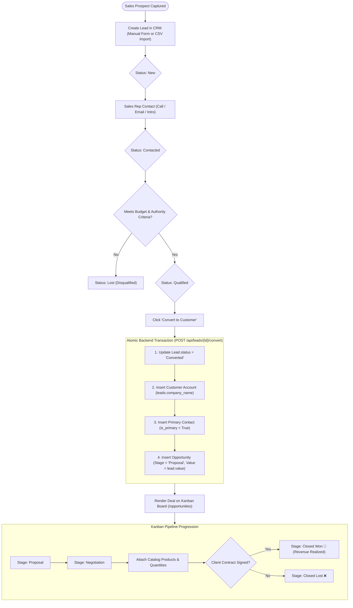

# Diagram: Lead-to-Deal Sales Flow

The following sequence and state diagram models the complete journey of a sales lead from initial capture to a closed deal with associated products.

---

```mermaid
flowchart TD
    Start([Sales Prospect Captured]) --> LeadCreation["Create Lead in CRM (Manual Form or CSV Import)"]
    LeadCreation --> LeadStateNew{"Status: New"}

    LeadStateNew --> Outreach["Sales Rep Contact (Call / Email / Intro)"]
    Outreach --> LeadStateContacted{"Status: Contacted"}

    LeadStateContacted --> Evaluation{"Meets Budget & Authority Criteria?"}
    Evaluation -- No --> LeadLost["Status: Lost (Disqualified)"]
    Evaluation -- Yes --> LeadQualified{"Status: Qualified"}

    LeadQualified --> ConvertAction["Click 'Convert to Customer'"]

    subgraph AtomicConversion["Atomic Backend Transaction (POST /api/leads/{id}/convert)"]
        direction TB
        MarkConverted["1. Update Lead.status = 'Converted'"]
        CreateCust["2. Insert Customer Account (leads.company_name)"]
        CreateContact["3. Insert Primary Contact (is_primary = True)"]
        CreateDeal["4. Insert Opportunity (Stage = 'Proposal', Value = lead.value)"]
        
        MarkConverted --> CreateCust --> CreateContact --> CreateDeal
    end

    ConvertAction --> AtomicConversion

    AtomicConversion --> PipelineBoard["Render Deal on Kanban Board (/opportunities)"]

    subgraph KanbanPipeline["Kanban Pipeline Progression"]
        direction LR
        Proposal["Stage: Proposal"] --> Negotiation["Stage: Negotiation"]
        Negotiation --> AttachProds["Attach Catalog Products & Quantities"]
        AttachProds --> CloseDecision{"Client Contract Signed?"}
        CloseDecision -- Yes --> ClosedWon["Stage: Closed Won 🎉 (Revenue Realized)"]
        CloseDecision -- No --> ClosedLost["Stage: Closed Lost ❌"]
    end

    PipelineBoard --> KanbanPipeline
```
