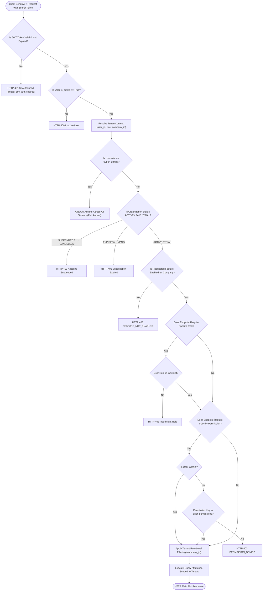

# Diagram: Role-Based Access Control (RBAC) Decision Flow

The following flowchart outlines the authorization and permission evaluation logic executed on incoming API requests.

---

```mermaid
flowchart TD
    Req([Client Sends API Request with Bearer Token]) --> AuthCheck{"Is JWT Token Valid & Not Expired?"}

    AuthCheck -- No --> Ret401["HTTP 401 Unauthorized (Trigger crm-auth-expired)"]
    AuthCheck -- Yes --> UserCheck{"Is User is_active == True?"}

    UserCheck -- No --> RetInactive["HTTP 400 Inactive User"]
    UserCheck -- Yes --> LoadContext["Resolve TenantContext (user_id, role, company_id)"]

    LoadContext --> IsSuperAdmin{"Is User role == 'super_admin'?"}

    IsSuperAdmin -- Yes --> Bypass["Allow All Actions Across All Tenants (Full Access)"]

    IsSuperAdmin -- No --> OrgStatusCheck{"Is Organization Status ACTIVE / PAID / TRIAL?"}

    OrgStatusCheck -- "SUSPENDED / CANCELLED" --> RetSuspended["HTTP 403 Account Suspended"]
    OrgStatusCheck -- "EXPIRED / UNPAID" --> RetExpired["HTTP 403 Subscription Expired"]
    OrgStatusCheck -- "ACTIVE / TRIAL" --> FeatCheck{"Is Requested Feature Enabled for Company?"}

    FeatCheck -- No --> RetFeatOff["HTTP 403 FEATURE_NOT_ENABLED"]
    FeatCheck -- Yes --> RoleCheck{"Does Endpoint Require Specific Role?"}

    RoleCheck -- Yes --> HasRole{"User Role in Whitelist?"}
    HasRole -- No --> Ret403Role["HTTP 403 Insufficient Role"]
    HasRole -- Yes --> PermCheck

    RoleCheck -- No --> PermCheck{"Does Endpoint Require Specific Permission?"}

    PermCheck -- Yes --> IsAdmin{"Is User 'admin'?"}
    IsAdmin -- Yes --> RowFilter["Apply Tenant Row-Level Filtering (company_id)"]
    IsAdmin -- No --> HasGrant{"Permission Key in user_permissions?"}
    HasGrant -- No --> Ret403Perm["HTTP 403 PERMISSION_DENIED"]
    HasGrant -- Yes --> RowFilter

    PermCheck -- No --> RowFilter

    RowFilter --> ExecQuery["Execute Query / Mutation Scoped to Tenant"]
    ExecQuery --> Ret200([HTTP 200 / 201 Response])
```
