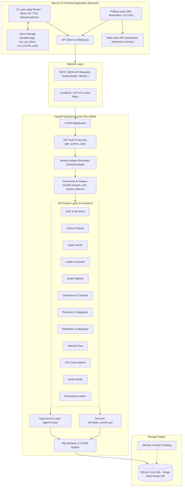

# Diagram: System Architecture

The following diagram illustrates the complete architectural topology of the Enterprise CRM platform.

---

```mermaid
flowchart TB
    subgraph Client["Next.js 14 Frontend Application (Browser)"]
        direction TB
        UI["UI Layer (App Router / React 18 / CSS Glassmorphism)"]
        Store["Client Storage (localStorage: crm_jwt_token, crm_current_user)"]
        API["API Client (src/lib/api.js)"]
        Pollers["Polling Loops (30s Reminders / 3s Chat)"]
        Audio["Web Audio API Synthesizer (Harmonic Chimes)"]

        UI <--> Store
        UI --> API
        Pollers --> API
        Pollers --> Audio
    end

    subgraph Network["Network Layer"]
        HTTP["REST JSON API Requests (Authorization: Bearer <JWT>)"]
        Fallback["Localhost / 127.0.0.1 Auto-Retry"]
    end

    subgraph Backend["FastAPI Backend Server (Port 8000)"]
        direction TB
        CORS["CORS Middleware"]
        AuthMid["JWT Auth & Security (get_current_user)"]
        TenantMid["Tenant Isolation Boundary (TenantContext)"]
        Guards["Permission & Feature Guards (require_role, require_feature)"]
        
        subgraph Endpoints["API Router Layer (14 Routers)"]
            R_Auth["Auth & Sessions"]
            R_Users["Users & Teams"]
            R_Super["Super Admin"]
            R_Leads["Leads & Convert"]
            R_Deals["Deals Pipeline"]
            R_Cust["Customers & Contacts"]
            R_Prod["Products & Categories"]
            R_Rem["Reminders & Meetings"]
            R_Chat["Internal Chat"]
            R_Imp["CSV Data Imports"]
            R_Act["Audit Activity"]
            R_Perm["Permissions Matrix"]
        end

        Services["Services (template_service.py)"]
        CRUD["Data Access Layer (app/crud.py)"]
        ORM["SQLAlchemy 2.0 ORM Engine"]
    end

    subgraph Database["Storage Engine"]
        SQLite[("SQLite 3 (crm.db) - Single Multi-Tenant DB")]
        Alembic["Alembic Version Tracking"]
    end

    API --> Network --> CORS
    CORS --> AuthMid --> TenantMid --> Guards --> Endpoints
    Endpoints --> Services
    Endpoints --> CRUD
    CRUD --> ORM
    Services --> ORM
    ORM --> SQLite
    Alembic -.-> SQLite
```
